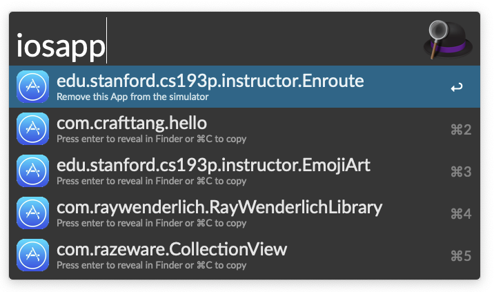

# iosapp-home-folder
An Alfred 4 workflow for getting your App home folder of your active simulator.

## Usage:

* Reveal the App in Finder

```
iosapp [Enter]
```


* Delete the App from the simulator

```
iosapp [hold Option] + [Enter]
```




